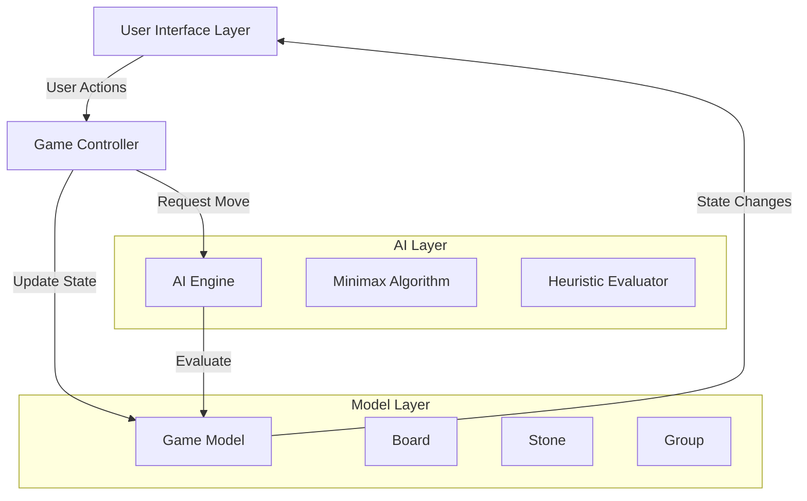

# Design Document

## Overview

The 9x9 Go Game System is a desktop application that implements the traditional game of Go on a 9x9 board. The system supports both human-vs-human and human-vs-computer gameplay modes. The computer opponent uses a Heuristic Minimax Search algorithm with alpha-beta pruning for efficient move selection. The application follows object-oriented design principles with clear separation of concerns between game logic, AI, and user interface.

## Architecture

The system follows a Model-View-Controller (MVC) architectural pattern:



### Technology Stack

- **Language**: Python 3.8+ (recommended for rapid development and rich library support)
- **GUI Framework**: Pygame (for better graphics and smooth animations)
- **Data Structures**: 2D arrays for board representation, sets for group tracking

## Components and Interfaces

### 1. Board Component

**Responsibility**: Manages the game board state, stone placement, and rule enforcement.

**Class: Board**
```python
class Board:
    def __init__(self, size: int = 9)
    def place_stone(self, row: int, col: int, color: str) -> bool
    def remove_stones(self, positions: List[Tuple[int, int]]) -> None
    def get_stone(self, row: int, col: int) -> Optional[str]
    def is_valid_move(self, row: int, col: int, color: str) -> bool
    def get_liberties(self, row: int, col: int) -> int
    def get_group(self, row: int, col: int) -> Set[Tuple[int, int]]
    def find_captured_stones(self, color: str) -> List[Tuple[int, int]]
    def check_ko_rule(self, row: int, col: int, color: str) -> bool
    def clone(self) -> Board
    def get_empty_positions(self) -> List[Tuple[int, int]]
```

**Key Design Decisions**:
- Use a 2D list (9x9) to represent the board, with values: None (empty), 'black', 'white'
- Store previous board state as a hash to enforce Ko rule
- Implement flood-fill algorithm to identify connected groups
- Cache liberty counts for performance optimization

### 2. Game Controller Component

**Responsibility**: Orchestrates game flow, manages turns, and coordinates between UI and game logic.

**Class: GameController**
```python
class GameController:
    def __init__(self, mode: str = 'human_vs_human')
    def start_game(self) -> None
    def make_move(self, row: int, col: int) -> bool
    def pass_turn(self) -> None
    def resign(self) -> None
    def get_current_player(self) -> str
    def is_game_over(self) -> bool
    def calculate_score(self) -> Dict[str, int]
    def request_ai_move(self) -> Tuple[int, int]
```

**Key Design Decisions**:
- Maintain game state: current player, move history, captured stones count
- Handle turn alternation automatically after valid moves
- Detect game end conditions (two consecutive passes or resignation)
- Delegate AI move calculation to AI engine

### 3. Player Component

**Responsibility**: Represents different player types with a common interface.

**Abstract Class: Player**
```python
class Player(ABC):
    def __init__(self, color: str)
    @abstractmethod
    def get_move(self, board: Board) -> Tuple[int, int]
```

**Class: HumanPlayer**
```python
class HumanPlayer(Player):
    def get_move(self, board: Board) -> Tuple[int, int]
    # Returns move from UI input queue
```

**Class: AIPlayer**
```python
class AIPlayer(Player):
    def __init__(self, color: str, depth_limit: int = 3)
    def get_move(self, board: Board) -> Tuple[int, int]
    # Returns move from Minimax algorithm
```

**Key Design Decisions**:
- Use abstract base class to enable polymorphism
- Human player gets moves from UI event queue
- AI player encapsulates the minimax algorithm

### 4. AI Engine Component

**Responsibility**: Implements the Heuristic Minimax Search algorithm with alpha-beta pruning.

**Class: MinimaxAI**
```python
class MinimaxAI:
    def __init__(self, depth_limit: int, heuristic: HeuristicEvaluator)
    def find_best_move(self, board: Board, color: str) -> Tuple[int, int]
    def minimax(self, board: Board, depth: int, alpha: float, beta: float, 
                maximizing: bool, color: str) -> float
    def get_possible_moves(self, board: Board) -> List[Tuple[int, int]]
```

**Key Design Decisions**:
- Implement alpha-beta pruning to reduce search space
- Limit move generation to reduce branching factor (consider only moves near existing stones after opening)
- Use iterative deepening for time management
- Cache evaluated positions using transposition table

### 5. Heuristic Evaluator Component

**Responsibility**: Evaluates board positions to guide AI decision-making.

**Class: HeuristicEvaluator**
```python
class HeuristicEvaluator:
    def evaluate(self, board: Board, color: str) -> float
    def evaluate_territory(self, board: Board, color: str) -> float
    def evaluate_groups(self, board: Board, color: str) -> float
    def evaluate_captures(self, board: Board, color: str) -> float
    def evaluate_strategic_positions(self, board: Board, color: str) -> float
```

**Heuristic Function Design**:

The heuristic function combines multiple factors:

**H(board, color) = w1 × Territory + w2 × GroupStrength + w3 × Captures + w4 × Strategic**

Where:
- **Territory** (weight: 1.0): Count of empty intersections closer to player's stones using influence map
- **GroupStrength** (weight: 1.5): Sum of (liberties × group_size) for all groups
- **Captures** (weight: 2.0): Difference in captured stones (actual + potential)
- **Strategic** (weight: 0.8): Bonus for corner (3 points), edge (2 points), and center (1 point) positions

**Justification**:
- Territory reflects the primary winning condition in Go
- Group strength ensures AI builds strong, connected positions with many liberties
- Captures are weighted heavily as they directly reduce opponent's score
- Strategic positioning guides opening play toward valuable board areas
- Weights are tuned to balance immediate tactical gains with long-term strategic advantage

### 6. User Interface Component

**Responsibility**: Renders the game board and handles user interactions.

**Class: GameUI**
```python
class GameUI:
    def __init__(self, controller: GameController)
    def draw_board(self) -> None
    def draw_stone(self, row: int, col: int, color: str) -> None
    def draw_grid(self) -> None
    def handle_click(self, x: int, y: int) -> None
    def show_turn_indicator(self, color: str) -> None
    def show_captured_count(self, black: int, white: int) -> None
    def show_game_over(self, winner: str, scores: Dict) -> None
    def highlight_intersection(self, row: int, col: int) -> None
```

**Key Design Decisions**:
- Use Pygame surface for board rendering with double buffering
- Convert pixel coordinates to board coordinates on click events
- Provide visual feedback: hover effects, last move marker, captured stones animation
- Display game information in side panel: turn, captures, timer
- Use Pygame's event system for mouse interaction
- Render at 60 FPS for smooth animations

## Data Models

### Board State Representation

```python
# 2D array representation
board_state: List[List[Optional[str]]] = [[None] * 9 for _ in range(9)]

# Example:
# board_state[row][col] = 'black' | 'white' | None
```

### Game State

```python
@dataclass
class GameState:
    board: Board
    current_player: str  # 'black' or 'white'
    captured_black: int
    captured_white: int
    move_history: List[Tuple[int, int, str]]
    consecutive_passes: int
    ko_position: Optional[int]  # Hash of previous board state
```

### Move Representation

```python
@dataclass
class Move:
    row: int
    col: int
    color: str
    is_pass: bool = False
```

## Error Handling

### Invalid Move Handling

- **Occupied Intersection**: Display message "Position already occupied"
- **Self-Capture**: Display message "Invalid move: self-capture not allowed"
- **Ko Violation**: Display message "Invalid move: Ko rule violation"
- **Out of Bounds**: Silently ignore clicks outside the board

### AI Computation Errors

- **Timeout**: If AI exceeds 5 seconds, return a random valid move
- **No Valid Moves**: Automatically pass turn
- **Exception in Heuristic**: Log error and use simplified evaluation

### UI Errors

- **Rendering Failure**: Catch exceptions and attempt to redraw
- **Event Handling**: Validate all user inputs before processing

## Testing Strategy

### Unit Testing

1. **Board Logic Tests**
   - Test stone placement on empty and occupied positions
   - Test liberty calculation for various configurations
   - Test group detection using flood-fill
   - Test capture detection for single stones and groups
   - Test Ko rule enforcement
   - Test self-capture prevention

2. **Heuristic Function Tests**
   - Test territory evaluation on known positions
   - Test group strength calculation
   - Test capture evaluation
   - Verify heuristic values are normalized correctly

3. **Minimax Algorithm Tests**
   - Test depth limiting
   - Test alpha-beta pruning correctness
   - Verify best move selection on simple positions
   - Test move ordering optimization

### Integration Testing

1. **Game Flow Tests**
   - Test complete game from start to finish
   - Test turn alternation
   - Test score calculation at game end
   - Test resignation and pass functionality

2. **AI vs AI Tests**
   - Run multiple AI vs AI games to verify no crashes
   - Verify games terminate properly
   - Check for infinite loops or deadlocks

### Manual Testing

1. **UI Responsiveness**
   - Test mouse click accuracy
   - Test hover effects
   - Test visual feedback for invalid moves

2. **AI Performance**
   - Measure average move calculation time
   - Verify AI makes reasonable moves
   - Test AI behavior in different game phases

## Performance Considerations

### Minimax Optimization

- **Alpha-Beta Pruning**: Reduces nodes evaluated by ~50%
- **Move Ordering**: Evaluate captures and threats first
- **Transposition Table**: Cache evaluated positions (up to 10,000 entries)
- **Iterative Deepening**: Start with depth 1, increase until time limit

### Depth Limit Strategy

The depth limit adapts to game phase:

| Game Phase | Empty Intersections | Depth Limit | Rationale |
|------------|-------------------|-------------|-----------|
| Opening | > 60 | 2 | High branching factor, focus on strategic positions |
| Middle | 30-60 | 3 | Balanced search, tactical opportunities emerge |
| Endgame | < 30 | 4 | Lower branching factor, deeper search feasible |

**Justification**:
- Opening: Branching factor ~81, depth 2 evaluates ~6,500 positions (manageable)
- Middle: Branching factor ~40, depth 3 evaluates ~64,000 positions (acceptable)
- Endgame: Branching factor ~20, depth 4 evaluates ~160,000 positions (within 5-second limit)

### UI Performance

- Redraw only changed board regions
- Use double buffering to prevent flicker
- Limit animation frame rate to 30 FPS

## Implementation Notes

### Move Generation Optimization

After the opening phase (>10 moves), limit move generation to:
- Empty intersections adjacent to existing stones
- Empty intersections within 2 spaces of existing stones
- Strategic points (corners, star points) if still empty

This reduces branching factor from 81 to typically 15-25 moves.

### Ko Rule Implementation

Store hash of board state after each move:
```python
def board_hash(self) -> int:
    return hash(tuple(tuple(row) for row in self.board_state))
```

Compare current board hash with previous hash to detect Ko violation.

### Group and Liberty Calculation

Use Union-Find (Disjoint Set) data structure for efficient group management:
- O(α(n)) for union and find operations
- Update groups incrementally after each move
- Recalculate liberties only for affected groups

## Extensibility

The design supports future enhancements:

- **Larger Board Sizes**: Parameterize board size in Board class
- **Different Rule Sets**: Abstract rule enforcement into RuleSet interface
- **Stronger AI**: Implement Monte Carlo Tree Search as alternative to Minimax
- **Network Play**: Add NetworkPlayer class implementing Player interface
- **Game Recording**: Extend move history to SGF (Smart Game Format) export
- **Difficulty Levels**: Adjust depth limit and heuristic weights
